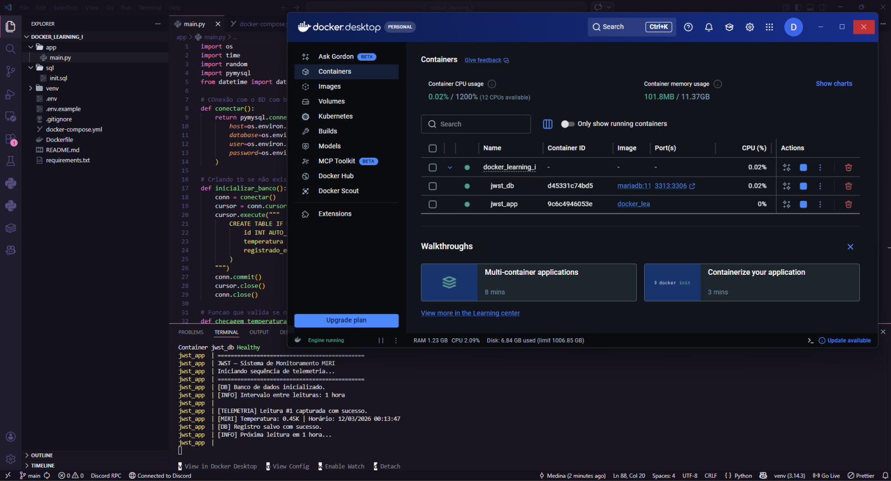

# Estudos - Docker

Repositório dedicado aos meus estudos de Docker.

---

## Projetos

### JWST MIRI Monitor
Simulador de leituras de temperatura inspirado no instrumento MIRI do James Webb Space Telescope.

O script gera leituras automáticas a cada hora (na realidade, a cada 2mins pois é uma versão de testes) e persiste os dados num banco MariaDB - tudo orquestrado via Docker Compose.

**Stack:** Python · MariaDB · Docker · Docker Compose

**Conceitos praticados:**
- Dockerfile com multi-stage e boas práticas
- docker-compose com healthcheck e depends_on
- Volumes para persistência de dados
- Redes isoladas entre containers
- Variáveis de ambiente com `.env`

---

*Estudos em andamento - novos projetos em breve :D*